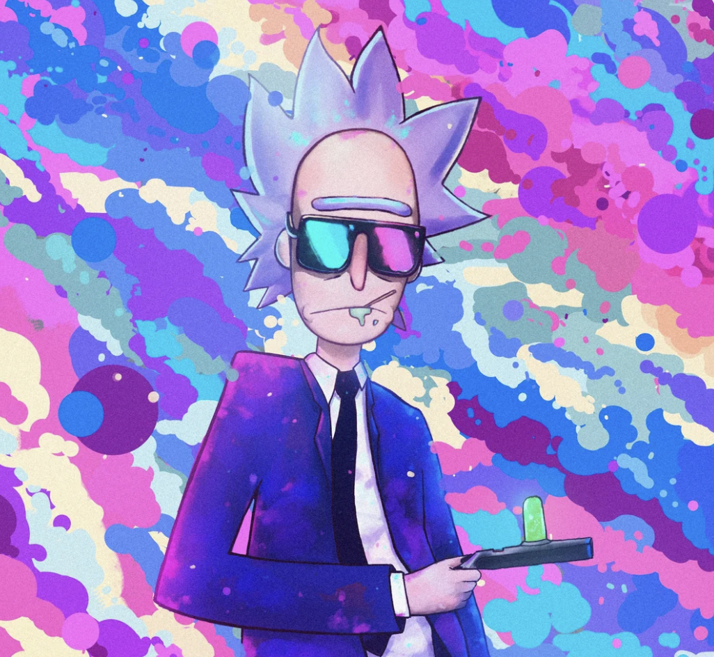

# shadcnai


<div align="center">
  
 <div> A CLI tool for generating beautiful shadcn/ui themes using natural language descriptions.</div>
</div>


## Quick Start

```bash
# Set your API key (Google AI is default)
export GOOGLE_GENERATIVE_AI_API_KEY=your-google-ai-key

# Generate a theme
npx shadcnai theme "neo brutalism theme with pink sunset vibes"
```

## More Usage Examples

```bash
# Generate a dark purple theme
npx shadcnai theme "dark theme with purple accents"

# Use OpenAI models
export OPENAI_API_KEY=your-openai-key
npx shadcnai theme "ocean sunset colors" --model gpt-4.1

# Use Anthropic Claude
export ANTHROPIC_API_KEY=your-anthropic-key
npx shadcnai theme "clean matrix movie style" --model claude-3-5-sonnet-20241022

# Use xAI Grok
export XAI_API_KEY=your-xai-key
npx shadcnai theme "cyberpunk neon theme" --model grok-beta

# Control creativity with temperature (0.0-2.0)
npx shadcnai theme "elegant theme" --temperature 0.3  # More focused/consistent
npx shadcnai theme "wild creative theme" --temperature 1.5  # More creative/diverse

# Generate and save without auto-import
npx shadcnai theme "minimalist design" --no-import
```

## Supported Models

### Google AI (Default)

- `gemini-2.5-flash` (**default**)
- `gemini-2.0-flash`
- `gemini-2.5-flash-lite`
- `gemini-1.5-flash`
- `gemini-1.5-pro`

### OpenAI

- `gpt-4.1`
- `gpt-4.1-mini`
- `gpt-4o`
- `gpt-4o-mini`

### Anthropic

- `claude-3-5-sonnet-20241022`
- `claude-3-5-sonnet-20240620`
- `claude-3-5-haiku-20241022`
- `claude-3-sonnet-20240229`
- `claude-3-haiku-20240307`

### xAI

- `grok-beta`
- `grok-2-1212`
- `grok-2-vision-1212`

### DeepSeek

- `deepseek-chat`
- `deepseek-reasoner`

### Mistral

- `mistral-large-latest`
- `mistral-small-latest`
- `pixtral-large-latest`

### Cerebras

- `llama3.1-8b`
- `llama3.1-70b`
- `llama3.3-70b`
- `llama-4-scout-17b-16e-instruct`
- `llama-4-maverick-17b-128e-instruct`
- `deepseek-r1-distill-llama-70b`
- `qwen-3-32b`
- `qwen-3-235b-a22b`

want more models? - create a [github issue](https://github.com/vivek9patel/shadcnai/issues)

## Package

- **[`packages/shadcnai/`](./packages/shadcnai/)** - The main CLI package with full documentation

## Built with

- **[AI SDK](https://sdk.vercel.ai/)** - For AI model integrations
- **[shadcn/ui](https://ui.shadcn.com/)** - For the component system
