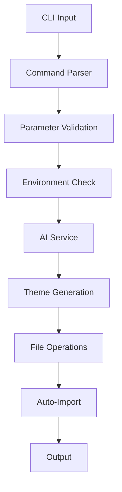

# Development

Learn how to contribute to shadcnai, set up the development environment, and understand the project architecture.

## Project Structure

```
packages/shadcnai/
├── src/
│   ├── cli.ts                    # CLI entry point
│   ├── commands/
│   │   ├── index.ts              # Command exports
│   │   └── theme.ts              # Theme generation command
│   ├── constants/
│   │   └── models.ts             # AI model definitions
│   ├── lib/
│   │   ├── animations.ts         # CLI animations and UI
│   │   ├── css.ts               # CSS generation utilities
│   │   ├── env.ts               # Environment validation
│   │   ├── files.ts             # File operations
│   │   ├── models.ts            # AI model configurations
│   │   └── utils.ts             # General utilities
│   ├── prompts/
│   │   └── theme-generation.ts  # AI prompts for theme generation
│   ├── services/
│   │   └── theme-generator.ts   # Core theme generation service
│   └── types/
│       └── theme.ts             # TypeScript type definitions
├── package.json
├── tsconfig.json
└── README.md
```

## Development Setup

### Prerequisites

- **Node.js** ≥ 18.0.0
- **npm** ≥ 9.0.0
- **Git** for version control
- AI provider API keys for testing

### Getting Started

1. **Clone the repository**:

   ```bash
   git clone https://github.com/vivek9patel/shadcnai.git
   cd shadcnai/packages/shadcnai
   ```

2. **Install dependencies**:

   ```bash
   npm install
   ```

3. **Set up environment variables**:

   ```bash
   # Copy example environment file
   cp .env.example .env

   # Add your API keys
   echo "GOOGLE_GENERATIVE_AI_API_KEY=your-key" >> .env
   echo "OPENAI_API_KEY=your-key" >> .env
   # ... add other providers as needed
   ```

4. **Build the project**:

   ```bash
   npm run build
   ```

5. **Run in development mode**:

   ```bash
   npm run dev
   ```

6. **Test your changes**:

   ```bash
   # Test the CLI locally
   node dist/cli.js theme "test theme"

   # Or link for global testing
   npm link
   shadcnai theme "test theme"
   ```

## Development Scripts

### Available Commands

```bash
# Clean build directory
npm run clean

# Build TypeScript to JavaScript
npm run build

# Run tests
npm run test

# Lint code
npm run lint

# Fix linting issues
npm run lint:fix

# Type check without building
npm run typecheck

# Watch mode for development
npm run dev

# Prepare for publishing
npm run prepack
```

### Development Workflow

1. **Start development mode**:

   ```bash
   npm run dev
   ```

2. **Make your changes** in the `src/` directory

3. **Test changes locally**:

   ```bash
   node dist/cli.js theme "your test description"
   ```

4. **Run tests**:

   ```bash
   npm test
   ```

5. **Lint and fix**:
   ```bash
   npm run lint:fix
   ```

## Architecture Overview

### Core Components

#### CLI Interface (`cli.ts`)

- Main entry point using yargs
- Command parsing and validation
- Help and version handling

#### Command System (`commands/`)

- Modular command structure
- Theme generation command implementation
- Parameter validation and processing

#### AI Integration (`services/theme-generator.ts`)

- Abstracted AI provider interactions
- Model selection and switching
- Error handling and retries

#### File Management (`lib/files.ts`)

- Theme file generation
- Auto-import with shadcn CLI
- File system operations

#### Type System (`types/theme.ts`)

- Zod schemas for validation
- TypeScript type definitions
- Data structure consistency

### Data Flow



## Adding New Features

### Adding a New AI Provider

1. **Update model constants** (`constants/models.ts`):

   ```typescript
   export const AI_PROVIDERS = {
     // ... existing providers
     newProvider: {
       name: "New Provider",
       envKey: "NEW_PROVIDER_API_KEY",
       models: ["model-1", "model-2"] as const,
     },
   } as const;
   ```

2. **Add provider integration** (`lib/models.ts`):

   ```typescript
   import { createNewProvider } from "@ai-sdk/new-provider";

   export function createModel(model: SupportedModel) {
     // ... existing provider logic

     if (provider?.key === "newProvider") {
       const newProvider = createNewProvider({
         apiKey: process.env.NEW_PROVIDER_API_KEY,
       });
       return newProvider(model);
     }
   }
   ```

3. **Update environment validation** (`lib/env.ts`):
   ```typescript
   export async function validateEnvironment(model: SupportedModel) {
     // ... existing validation

     if (provider?.envKey === "NEW_PROVIDER_API_KEY") {
       if (!process.env.NEW_PROVIDER_API_KEY) {
         throw new Error(`Missing ${provider.envKey} environment variable`);
       }
     }
   }
   ```

### Adding New Command Options

1. **Update command builder** (`commands/theme.ts`):

   ```typescript
   builder: {
     // ... existing options
     newOption: {
       alias: "n",
       describe: "Description of new option",
       type: "string" as const,
       default: "default-value",
     },
   }
   ```

2. **Handle option in command** (`commands/theme.ts`):
   ```typescript
   handler: async (argv: any) => {
     const { newOption } = argv;

     // Use the new option in your logic
     const result = await ThemeGeneratorService.generateTheme(description, {
       newOption,
     });
   };
   ```

### Extending Theme Schema

1. **Update Zod schema** (`types/theme.ts`):

   ```typescript
   export const ThemeSchema = z.object({
     // ... existing fields
     newField: z.string().describe("Description of new field"),
   });
   ```

2. **Update generation logic** (`services/theme-generator.ts`):
   ```typescript
   // Ensure AI prompt includes new field
   // Update file generation to handle new field
   ```

## Testing

### Running Tests

```bash
# Run all tests
npm test

# Run tests in watch mode
npm run test:watch

# Run tests with coverage
npm run test:coverage
```

### Writing Tests

Test files are located alongside source files with `.test.ts` extension:

```typescript
// src/lib/utils.test.ts
import { describe, it, expect } from "@jest/globals";
import { yourFunction } from "./utils";

describe("yourFunction", () => {
  it("should handle valid input", () => {
    const result = yourFunction("valid input");
    expect(result).toBe("expected output");
  });

  it("should throw on invalid input", () => {
    expect(() => yourFunction("invalid")).toThrow();
  });
});
```

### Testing with AI Models

For testing with actual AI models, use environment variables:

```typescript
// Only run AI tests if API keys are available
const hasApiKey = process.env.GOOGLE_GENERATIVE_AI_API_KEY;

describe("ThemeGenerator", () => {
  it.skipIf(!hasApiKey)("should generate valid theme", async () => {
    const result = await generateTheme("test theme");
    expect(result).toMatchSchema(ThemeSchema);
  });
});
```

## Code Style and Standards

### TypeScript Configuration

The project uses strict TypeScript settings:

```json
{
  "compilerOptions": {
    "strict": true,
    "noImplicitAny": true,
    "noImplicitReturns": true,
    "noUnusedLocals": true,
    "noUnusedParameters": true
  }
}
```

### ESLint Configuration

Code style is enforced with ESLint:

```bash
# Check linting
npm run lint

# Fix auto-fixable issues
npm run lint:fix
```

### Formatting Standards

- Use 2 spaces for indentation
- Prefer `const` over `let`
- Use template literals for string interpolation
- Add JSDoc comments for public APIs
- Use descriptive variable names

### Commit Messages

Follow conventional commits:

```
feat: add support for new AI provider
fix: handle API rate limiting gracefully
docs: update installation instructions
test: add tests for theme validation
chore: update dependencies
```

## Contributing

### Contribution Process

1. **Fork the repository**
2. **Create a feature branch**:
   ```bash
   git checkout -b feature/your-feature-name
   ```
3. **Make your changes**
4. **Add tests** for new functionality
5. **Update documentation** if needed
6. **Run tests and linting**:
   ```bash
   npm test
   npm run lint
   ```
7. **Commit with conventional format**
8. **Push and create pull request**

### Pull Request Guidelines

- Include clear description of changes
- Add tests for new features
- Update documentation
- Ensure CI passes
- Link related issues

### Issue Reporting

When reporting issues:

1. **Use issue templates**
2. **Include reproduction steps**
3. **Provide environment details**
4. **Include error messages**
5. **Add relevant logs**

## Release Process

### Versioning

The project follows semantic versioning:

- **Patch** (1.0.1): Bug fixes
- **Minor** (1.1.0): New features (backward compatible)
- **Major** (2.0.0): Breaking changes

### Publishing

Releases are automated through GitHub Actions:

1. **Create release PR** with version bump
2. **Merge to main** triggers CI/CD
3. **Automated testing** and building
4. **Publish to npm** if tests pass
5. **Create GitHub release** with changelog

### Manual Release

For manual releases:

```bash
# Update version
npm version patch|minor|major

# Build and test
npm run build
npm test

# Publish
npm publish
```

## Debugging

### Common Issues

#### Build Errors

```bash
# Clean and rebuild
npm run clean
npm run build
```

#### API Errors

```bash
# Check environment variables
echo $GOOGLE_GENERATIVE_AI_API_KEY

# Test with verbose logging
DEBUG=shadcnai:* shadcnai theme "test"
```

#### Import Errors

```bash
# Verify shadcn CLI is available
npx shadcn@latest --help

# Check project structure
ls components.json
```

### Debug Mode

Enable debug logging:

```bash
export DEBUG=shadcnai:*
shadcnai theme "debug theme"
```

## Performance Optimization

### AI Model Performance

- **Model Selection**: Choose appropriate models for use case
- **Prompt Optimization**: Craft efficient prompts
- **Caching**: Cache common results
- **Retry Logic**: Handle transient failures

### File Operations

- **Async Operations**: Use async/await for I/O
- **Error Handling**: Graceful failure handling
- **Memory Management**: Stream large files

## Documentation

### Code Documentation

Use JSDoc for public APIs:

```typescript
/**
 * Generates a theme based on the provided description
 * @param description - Human-readable theme description
 * @param options - Generation options
 * @returns Promise resolving to generated theme
 */
export async function generateTheme(
  description: string,
  options: GenerationOptions
): Promise<Theme> {
  // Implementation
}
```

### Updating Documentation

Documentation is built with Fumadocs:

1. **Edit MDX files** in `app/docs/`
2. **Test locally**: `npm run dev`
3. **Build**: `npm run build`
4. **Deploy**: Automatic on merge to main

## Getting Help

### Community Resources

- **GitHub Issues**: Bug reports and feature requests
- **Discussions**: General questions and ideas
- **Discord**: Real-time community chat (if available)

### Development Questions

For development-specific questions:

1. Check existing issues and discussions
2. Review the codebase and tests
3. Ask in GitHub discussions
4. Create detailed issue if needed

## Next Steps

Ready to contribute? Start by:

1. **Setting up** the development environment
2. **Exploring** the codebase
3. **Running tests** to understand the system
4. **Finding** a good first issue to work on
5. **Joining** the community discussions

Thank you for contributing to shadcnai! 🎨
